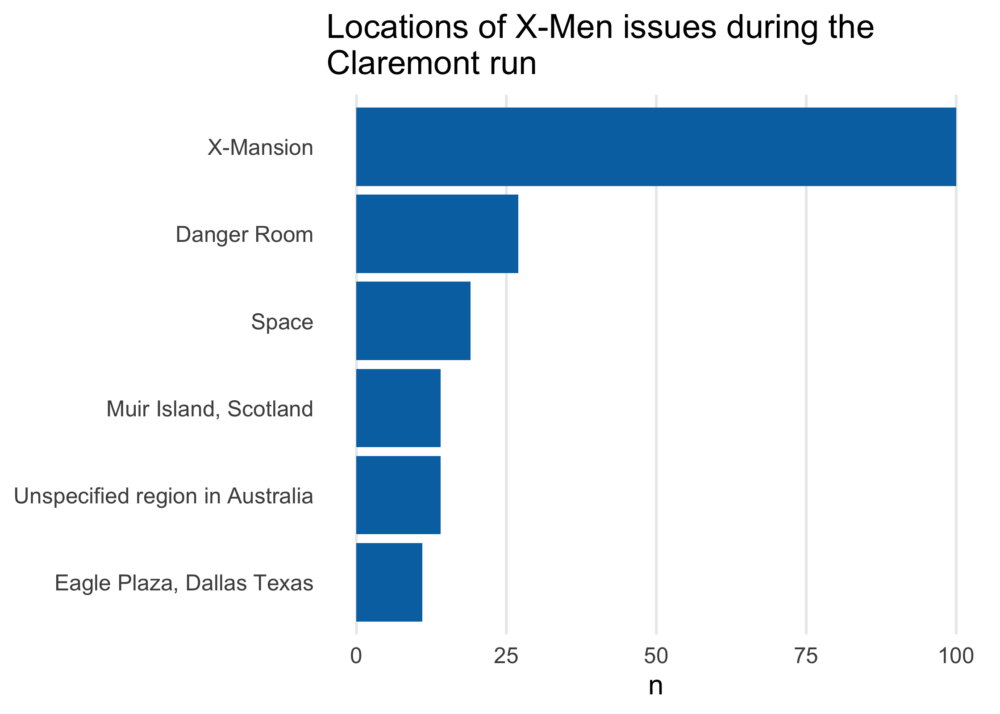

<!-- README.md is generated from README.Rmd. Please edit that file -->

# claremontrun 

<!-- badges: start -->

<!-- badges: end -->

claremontrun is an R data package that provides data from the [Claremont
Run](http://www.claremontrun.com/) project. This project collects data
on [Chris Claremont’s](https://www.wikiwand.com/en/Chris_Claremont)
iconic run on [Uncanny
X-Men](https://www.wikiwand.com/en/Uncanny_X-Men).

## Installation

claremontrun is not currently on CRAN. You can install the development
version of claremontrun from GitHub with:

``` r
# if needed
# install.packages("remotes")
remotes::install_github("malcolmbarrett/claremontrun")
```

## Data

claremontrun includes 7 data sets relevant to the Claremont run:

  - `character_visualization`, counts of character speech, thought,
    narrative, or visual depictions
  - `characters`, descriptions of character actions
  - `comic_bechdel`, whether or not an issue of another (non-X-Men)
    comic series met the Bechdel test
  - `covers`, data on covers of issues of Uncanny X-Men
  - `issue_collaborators`, data about other collaborators on each issue,
    such as editors
  - `location`, locations that appear in each issue
  - `xmen_bechdel`, whether or not an issue of Uncanny X-Men met the
    Bechdel test

## Example

``` r
library(claremontrun)
library(tidyverse)
#> ── Attaching packages ────────────────────────────────────────────────────────────────────────────────────────────────────────────────────────────────────────────────── tidyverse 1.2.1 ──
#> ✓ ggplot2 3.3.0.9000     ✓ purrr   0.3.3     
#> ✓ tibble  2.1.3          ✓ dplyr   0.8.3     
#> ✓ tidyr   1.0.0          ✓ stringr 1.4.0     
#> ✓ readr   1.3.1          ✓ forcats 0.4.0
#> ── Conflicts ───────────────────────────────────────────────────────────────────────────────────────────────────────────────────────────────────────────────────── tidyverse_conflicts() ──
#> x dplyr::filter() masks stats::filter()
#> x dplyr::lag()    masks stats::lag()
darkblue <- "#0072B2"
theme_minimal_vline <- function() {
  list(
    theme_minimal(14),
    theme(panel.grid.major.y = element_blank(), panel.grid.minor = element_blank())
  )
}

locations %>%
  drop_na(location) %>%
  count(location, sort = TRUE) %>%
  head() %>%
  ggplot(aes(x = n, y = fct_rev(fct_inorder(location)))) +
    geom_col(fill = darkblue) +
    theme_minimal_vline() +
    theme(axis.title.y = element_blank()) +
    ggtitle("Locations of X-Men issues during the\nClaremont run")
```



``` r

characters %>%
  group_by(issue) %>%
  summarise(n_tears = sum(visible_tears_number_of_panels)) %>%
  mutate(n_tears = replace_na(n_tears, 0)) %>%
  arrange(desc(n_tears)) %>%
  head(10) %>%
    ggplot(aes(x = n_tears, y = fct_rev(fct_inorder(as.character(issue))))) +
    geom_col(fill = darkblue) +
    theme_minimal_vline() +
    labs(y = "issue", x = "panels that included tears") +
    ggtitle("Number of panels that included tears")
```


